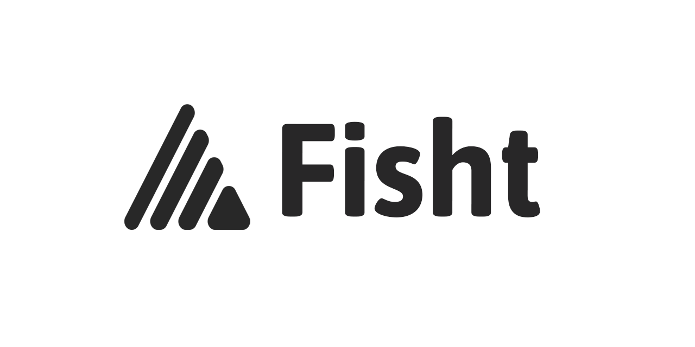
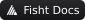
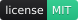

[](https://fisht.org)

<h1 align="center">
FishtVue
</h1>
<p align="center">
Beautiful components that you can use in your applications. 
<p>

<p align="center">
  <a href="https://fisht.org"></a>
  <a href="https://github.com/Egoka/FishtVue/blob/lib/LICENSE.md"></a>
  <a href="https://www.npmjs.com/package/fishtvue" target="__blank"></a>
  <a href="https://www.npmjs.com/package/fishtvue" target="__blank"></a>
  <a href="https://github.com/unovue/fishtvue" target="__blank"></a>
</p>

## Introduction

**FishtVue** is a Vue.js component library designed to create convenient and stylish user interfaces. It provides a set of highly customizable components that can be easily integrated into projects, helping accelerate development. The library is oriented towards modern design and supports features like theming, localization, and intuitive configuration options for each component.

Components can be configured both globally and individually, allowing them to be adapted for specific project needs. With TypeScript support, fishtvue easily integrates with various projects, providing stability and type safety.

## Installation and Setup

1.	Install **FishtVue** via npm or pnpm or yarn:

```bash
pnpm add fishtvue
```

```bash
npm install fishtvue
```

```bash
yarn add fishtvue
```


2.	Connect the library to your project. In the main.ts file, use createApp to integrate fishtvue with the desired configuration:
```
import { createApp } from 'vue';
import FishtVue, { type FishtVueConfiguration } from 'fishtvue/config';
import App from './App.vue';

const app = createApp(App);

// Integrate and configure the library
app.use<FishtVueConfiguration>(FishtVue, {
    componentsOptions: {
        Alert: {
            ... // Default setting for the Alert component
        }
        ... // Settings of other companions
    },
    locale: {
        en: {
           // Localization settings
        }
    },
    theme: {
        semantic: {
            customThemeColor: "50deg",
            customThemeColorContrast: "40%"
        }
        ... // Other theme settings
    }
    ... // Other library settings
});

app.mount('#app');
```


## Documentation

For more detailed information on each component and available configuration options, please refer to the full **FishtVue** documentation. The documentation includes usage examples, detailed parameter descriptions, and additional guides.

> ### [Fisht.org](https://fisht.org)

## Contribution

We welcome community contributions and are open to suggestions for improving **FishtVue**. If you have ideas for enhancing the library or find any issues, feel free to create an issue or submit a pull request. Please review our contribution guidelines and code standards before submitting.

## License

**FishtVue** is distributed under the Massachusetts Institute of Technology License (MIT License). This means the library is open source, allowing you to freely use, modify, and distribute it with attribution.